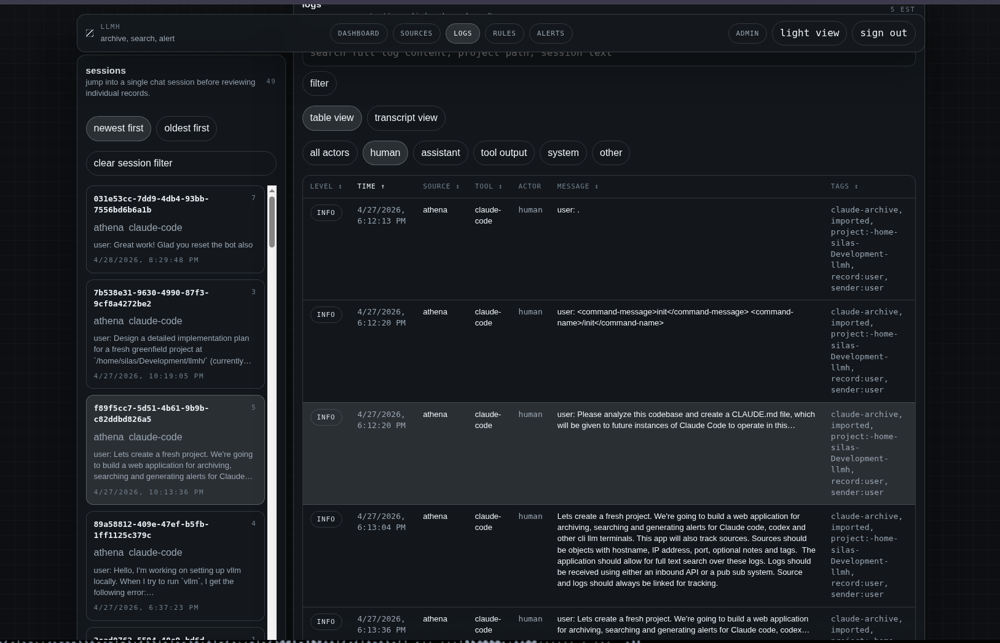

# llmh

Self-hosted web app for archiving, searching, and alerting on logs emitted by CLI LLM tools — Claude Code, Codex, Aider, and others.



## Features

- **Ingest** logs over HTTP or Redis Streams from any LLM CLI tool
- **Full-text search** powered by Meilisearch (Postgres is the source of truth)
- **Alert rules** — keyword, regex, source, or tag matching; delivers via webhook (Slack/Discord) and email
- **Multi-user** — local username/password auth with admin and viewer roles
- **Archive client** — ships Claude Code `.jsonl` and Codex rollout archives directly from your machine

## Stack

| Layer | Technology |
|---|---|
| API | Python 3.12 + FastAPI (async) |
| Database | PostgreSQL 16 |
| Search | Meilisearch |
| Queue | Redis Streams |
| Frontend | Next.js 15, Tailwind, shadcn/ui |
| Deploy | Docker Compose |

## Requirements

- Docker + Docker Compose v2
- `make`

## Quick start

```bash
git clone https://github.com/your-org/llmh.git
cd llmh

cp .env.example .env
# Edit .env — set strong values for POSTGRES_PASSWORD, MEILI_MASTER_KEY,
# INGEST_BEARER_TOKEN, and SESSION_SECRET before continuing.

make build
make start
```

The web UI is available at **http://localhost:3001** once all services are healthy (watch `make logs`).

## First-time setup

### Create an admin user

```bash
make user-add USERNAME=alice PASSWORD=secret ROLE=admin
```

Then log in at http://localhost:3001.

### Environment variables

Copy `.env.example` to `.env` and fill in the required values:

| Variable | Description |
|---|---|
| `POSTGRES_PASSWORD` | Postgres password |
| `MEILI_MASTER_KEY` | Meilisearch master key (≥ 32 chars) |
| `INGEST_BEARER_TOKEN` | Shared bearer token for `/ingest` |
| `SESSION_SECRET` | Cookie signing secret |
| `CORS_ORIGINS` | Comma-separated allowed origins for the UI |
| `SESSION_HTTPS_ONLY` | Set `false` for plain-HTTP local dev |
| `NEXT_PUBLIC_API_BASE_URL` | Browser-facing API URL (default `http://localhost:8000`) |
| `SMTP_HOST` / `SMTP_*` | Optional — needed for email alert delivery |
| `CLOUDFLARED_TUNNEL_TOKEN` | Optional — Cloudflare Tunnel token for production |

## Make targets

```bash
make build          # build all images
make start          # docker compose up -d
make stop           # docker compose down
make restart        # up -d --build
make status         # docker compose ps
make logs           # tail all logs

# Production overlay (adds cloudflared service)
make prod-build
make prod-start
make prod-stop
```

## User management

```bash
make user-add USERNAME=alice PASSWORD=secret ROLE=admin
make user-add USERNAME=bob   PASSWORD=secret ROLE=viewer
make user-list
make user-set-password USERNAME=alice PASSWORD=newsecret
make user-reset-link  USERNAME=alice BASE_URL=http://localhost:3001
```

## Running tests

Tests require the `postgres`, `redis`, and `meilisearch` services to be running (`make start`).

```bash
# API tests (pytest inside the api container)
docker compose run --rm api pytest

# Single file
docker compose run --rm api pytest tests/test_ingest.py

# Frontend tests (vitest)
docker compose run --rm web npm test
```

## Ingesting logs

### HTTP

```bash
curl -X POST http://localhost:8000/ingest \
  -H "Authorization: Bearer $INGEST_BEARER_TOKEN" \
  -H "Content-Type: application/json" \
  -d '{
    "source_key": {"name": "my-laptop"},
    "entries": [
      {"level": "info", "message": "session started", "tool": "claude-code"}
    ]
  }'
```

### Archive client (Claude Code / Codex)

The standalone client ships JSONL archives from your machine without running Docker:

```bash
pip install ./client

# Ship all Claude Code project archives
llmh-client ship \
  --host http://localhost:8000 \
  --token "$INGEST_BEARER_TOKEN" \
  --source-name my-laptop \
  --scan-path ~/.claude/projects

# Ship Codex rollout sessions
llmh-client ship \
  --host http://localhost:8000 \
  --token "$INGEST_BEARER_TOKEN" \
  --source-name my-laptop \
  --scan-path ~/.codex/sessions
```

See [`client/README.md`](client/README.md) for full usage.

## Database migrations

Migrations run automatically on `make start`. To manage them manually:

```bash
docker compose run --rm api alembic revision -m "description" --autogenerate
docker compose run --rm api alembic upgrade head
docker compose run --rm api alembic downgrade -1
```

## Architecture

See [`docs/architecture.md`](docs/architecture.md) for the full design, module map, and locked technical decisions.
